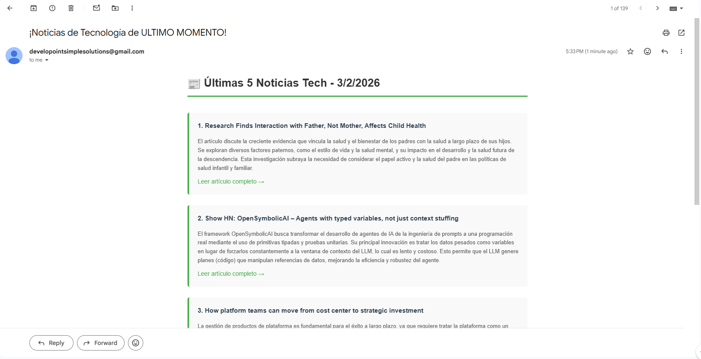
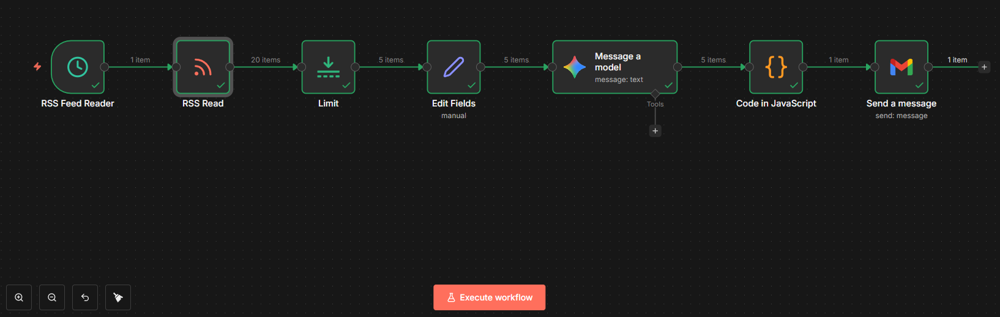

RSS AI Digest - Automatización de Noticias Tech

¿Qué hace este proyecto?

Resumen:
- Lee feeds RSS de sitios tech (Hacker News)
- Resume cada artículo con IA (Google Gemini)
- Envía un digest diario con las últimas 5 noticias por email

Stack tecnológico

- **n8n** - Plataforma de automatización
- **Google Gemini API** - Resúmenes con IA
- **Gmail** - Envío de emails
- **RSS Feed** - Fuente de noticias (Hacker News)

Resultado

*Email automatizado con las últimas 5 noticias resumidas por IA*

Estructura del workflow

1. **Schedule Trigger** - Se ejecuta cada 1 hora
2. **RSS Feed Read** - Lee Hacker News RSS
3. **Limit** - Limita a 5 artículos
4. **Google Gemini** - Resume cada artículo en español
5. **Code** - Formatea todo en HTML
6. **Gmail** - Envía el digest

Cómo replicarlo

1. Importar el workflow a tu instancia de n8n
2. Configurar credenciales de Gmail
3. Obtener API key de Google Gemini (gratis)
4. Activar el workflow
5. Recibir noticias automatizadas cada hora

Casos de uso

- ✅ Digest diario de noticias tech
- ✅ Monitoreo de blogs de competencia
- ✅ Curación automática de contenido
- ✅ Newsletter automatizado para clientes

## 📊 Próximas mejoras

- [ ] Agregar más fuentes RSS
- [ ] Enviar solo 1 email diario (no cada hora)
- [ ] Filtrar por keywords específicos
- [ ] Integración con Slack/Discord

## 👤 Autor

Sebastian - [LinkedIn](#) | [GitHub](https://github.com/sebastian-dev-arg)

**Parte de mi portafolio de automatizaciones con n8n**
